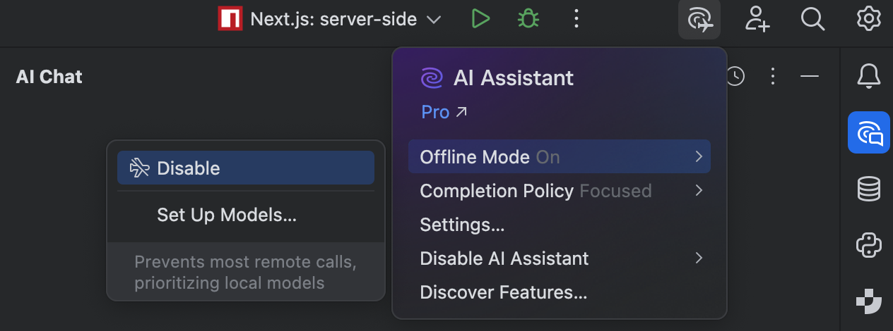
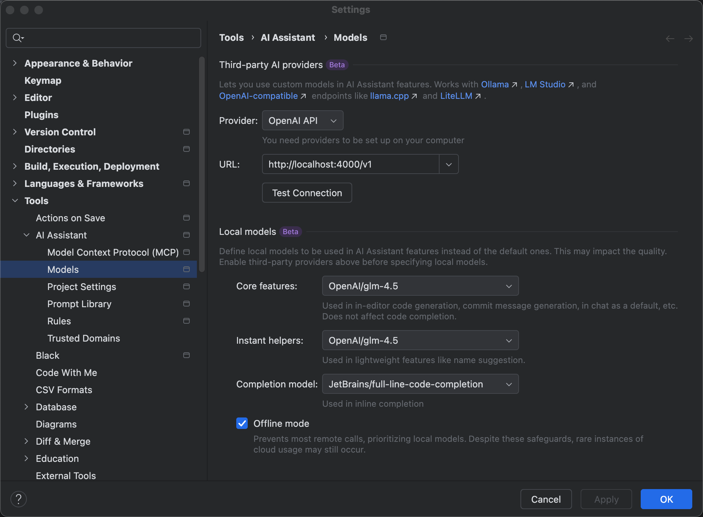

# JetBrains AI local llm proxy


因为 JetBrains AI(非企业版) 不支持 BYOK（Bring Your Own Key），只能使用本地没有 KEY 的 API，所以需要本地设置一个代理，把远程有 KEY 的 API 转换成
本地没有 KEY 的 API

可以使用 `llmlite[proxy]`` 这个包来进行配置

## llmlite[proxy]

```
pip install "litellm[proxy]"
```

## config.yaml

```yaml
model_list:
  - model_name: glm-4.5
    litellm_params:
      model: openai/glm-4.5
      api_base: "https://open.bigmodel.cn/api/paas/v4"
      api_key: "xxx"
  - model_name: kimi-k2
    litellm_params:
      model: kimi-k2-0905-preview
      api_base: https://api.moonshot.cn/v1
      api_key: "xxx"
  - model_name: deepseek-chat
    litellm_params:
      model: deepseek-chat
      api_base: "https://api.deepseek.com/v1"
      api_key: "xxx"
  - model_name: deepseek-reasoner
    litellm_params:
      model: deepseek-reasoner
      api_base: "https://api.deepseek.com/v1"
      api_key: "xxx"

litellm_settings:
  drop_params: true
  set_verbose: false
```

## run

```shell
litellm --config config.yaml --num_workers 1
```

## JetBrains AI Settings

需要设置成 `Offline Mode`






